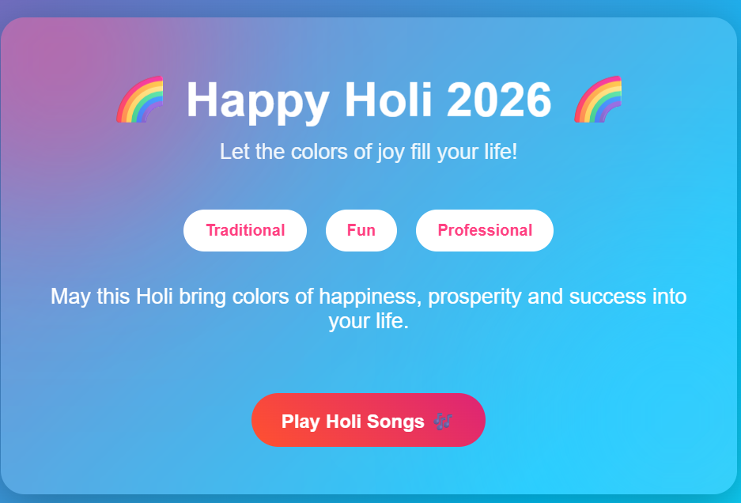

A colorful and interactive React Single Page Application (SPA) built using React + Vite.
This project features dynamic wish toggling, confetti animations, smooth UI transitions, and an embedded Holi music playlist.
...................................
🔗 Live Demo:
👉 https://wishholi.netlify.app/

🚀 Features
🌈 Animated gradient background
🎉 Confetti effects on interaction
💬 Dynamic wish style toggle (Traditional / Fun / Professional)
🎶 Embedded Holi song playlist
✨ Smooth slide animations
📱 Fully responsive design
🌍 Deployed on Netlify
..............................
🛠️ Tech Stack
⚛️ React (Functional Components)
🪝 React Hooks (useState, useEffect)
⚡ Vite (Build Tool)
🎨 CSS3 (Animations & Glassmorphism UI)
🎉 canvas-confetti (Animation Library)
🌐 Netlify (Deployment)

⚙️ Installation & Setup
1️⃣ Clone the Repository
git clone YOUR_GITHUB_REPO_LINK

2️⃣ Navigate into Project
cd holi-app

3️⃣ Install Dependencies
npm install

▶️ Run in Development Mode
npm run dev

🧠 Concepts Used
* Component-Based Architecture
* State Management using useState
* Side Effects using useEffect
* Conditional Rendering
* Dynamic Rendering with .map()
* CSS Animations & Transitions
* Production Build Optimization

👨‍💻 Author
Vishal
Frontend Developer | MERN Stack Learner